# Create Nginx Pod Using Minikube.
## This Project will cretae an nginx pod in minikube using dry run and inspect the pod for errors.

## Pre-requisite.
* You should have minikube and docker installed in your system. This project does not cover minikube installation.

## Set up ENV.
* Start Minikube.

* Run `minikube start` to start minikube node on your system.

### N//B I am running a 2-node cluster. I you wish to do same then,
* Run `minikube start --node=2` You cann add a flag -p<node name> if you want to name the worker node.

### Check your cluster status to be sure your node is up and running.

* `minikube status`

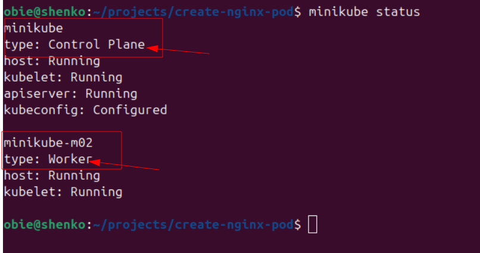

### Both control plane and worker nodes are up and running.

### Create Alias for kubectl key. This simply means you use 'k' instead of the full 'kubectl' keyword when running the command.

* Run `alias k=kubectl`

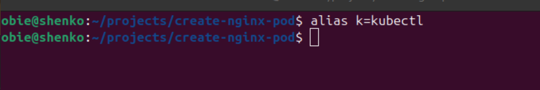

### Export dry run command.
* Run `export do="--dry-run=client -o yaml`

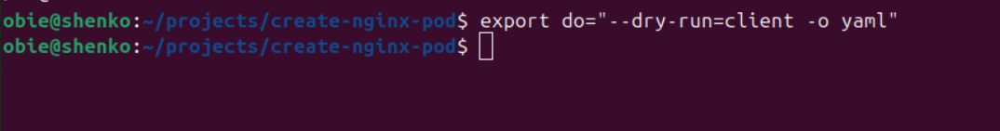

### Breakdown of the command.
* `export do = ` : create an ENV called do
* do stores a value `--dry-run=client -o yaml`
* You can now type `$do` instead of `--dry-run=client -o yaml`
* `--dry-run=client` means **Just prepare it, don't actually do it yet** 
* `-o yaml` means **Print it out as yaml**

### Create namespace 'dev' if not existing.

* Run `k create namespace dev` to create the dev namespace.

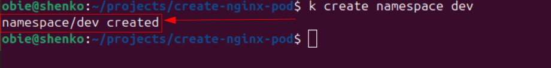

## Create the web-pod yaml (dry run).

* Run `k run web-pod --image=nginx --namespace=dev --port=80 $do > nginxpod.yaml`

* This will just create the yaml file and save it as nginxpod.yaml.

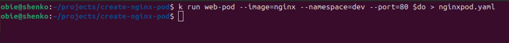

## View the yaml file.
* Run `cat nginxpod.yaml` to view the yaml file you created with the previous command.

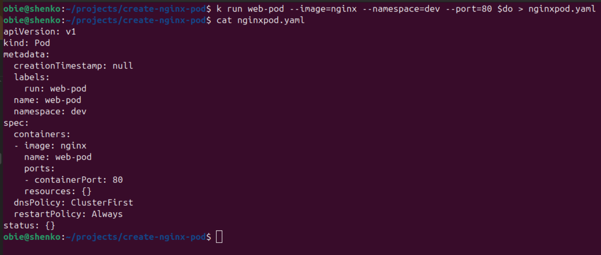

## Create the pod from yaml.

* Run `k apply -f nginxpod.yaml` to create the web-pod.

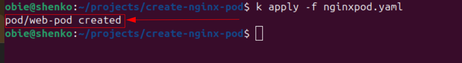

## Check pod status.
* To check if the pod is running `k get pods -n dev`

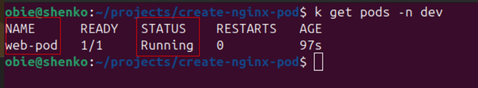

* Run `k describe pod web-pod -n dev` to see more detailed pod status.

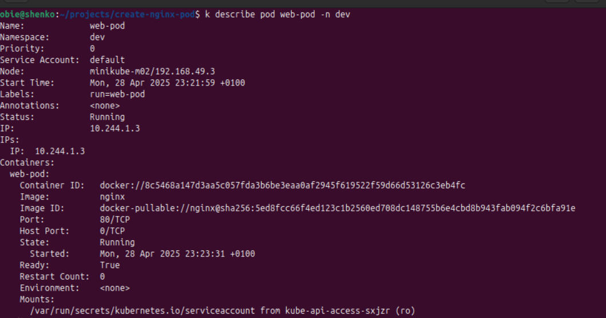

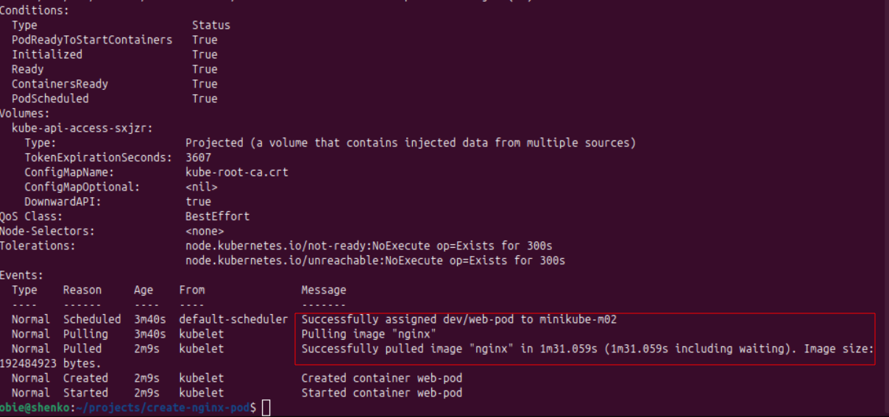

* Run `k logs web-pod -n dev` to view pod logs.

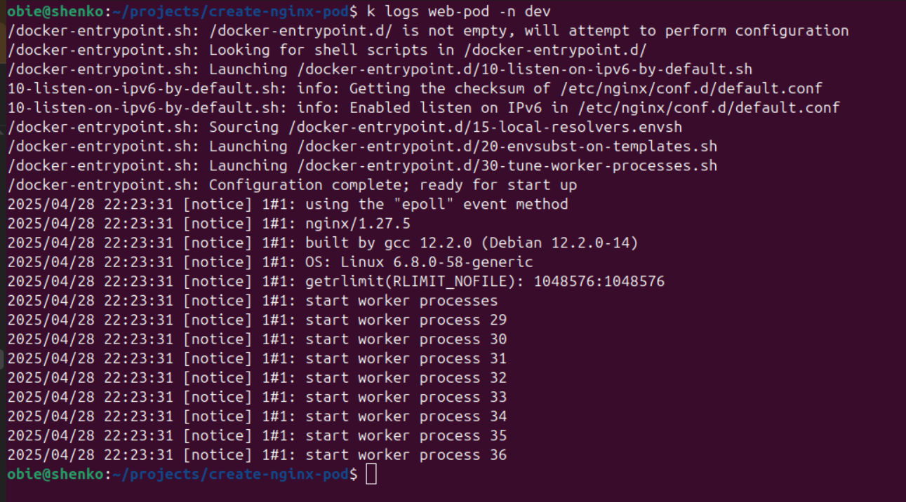

### Log into the pods exec terminal.

* Run `k exec -it web-pod -n dev --bin/bash` to log in to the pod's bash terminal.

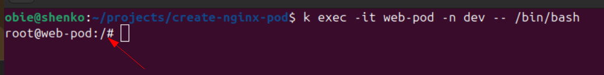

* execute `ls` command in the pod terminal.

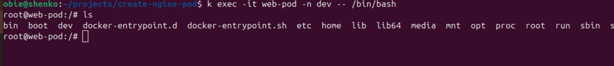

# Pod is up and running, so project execution is successful.
